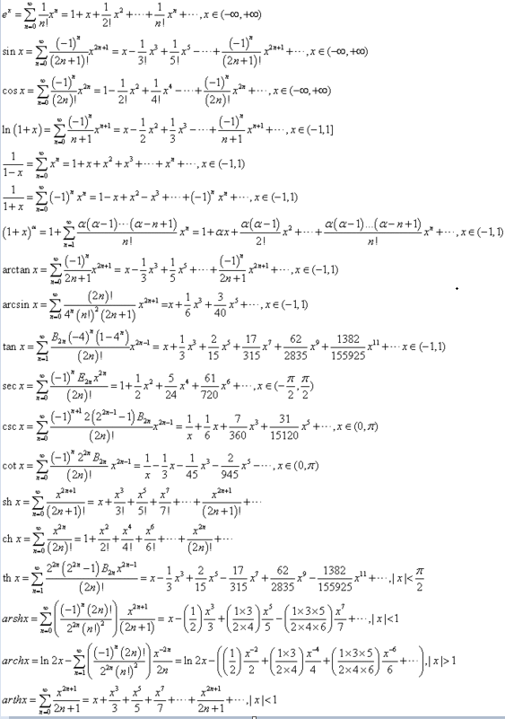

# 高等数学复习

## 函数奇偶性

### 一元函数

+ 一阶奇
+ 二阶偶
+ 三阶奇
+ -1阶奇
+ 根号/二分之一阶无奇偶性
+ 幂函数无
+ 对数函数无

### 三角函数

+ sin奇
+ cos偶
+ tan奇
+ cot奇
+ arc sin奇
+ arc cos无
+ arc tan奇
+ arc cot无

### 计算法则

+ 奇+奇=偶
+ 偶+-偶=偶
+ 奇x奇=偶
+ 奇x偶=奇
+ 偶x偶=偶

### 定义域

> 取x存在的区间

## 函数单调性

> 若函数求一阶导后y'>0, 则函数单调递增, 反之递减

---

## 导数

### 导数公式

+ C‘ = 0, C 为常数
+ (x^a)` = ax^a-1
+ (a^x)` = a^xlna
+ (e^x)` = e^x
+ (loga x)` = 1/xlna

---

## 偏导数

---

## 积分

### 不定积分

### 微分

### 定积分

---

## 极限

### 利用无穷小的性质求函数的极限

> 性质1: 有界函数与无穷小的乘积是无穷小
>
> 性质2: 常数与无穷小的乘积是无穷小
>
> 性质3: 有限个无穷小相加、相减及相乘仍旧无穷小

### 两个重要极限

+ limx->0 sinx/x =1
+ limx->∞ (1+1/x)^x =e

### 其他常见极限

+ limx->0 1-cosx = (x^2)/2
+ limx->0 根号1-x = -x/2
+ limx->0 sinx - tanx = -(x^3)/2
+ limx->0 xsin(n/x) = 0, sin为有界函数, x为无穷小量, 无穷小量×有界函数=0
+ limx->1 lnx = x-1

## 极限类型

### ∞/∞ 无穷比无穷型

### 1^∞ 1的无穷次方型

> x^f(x) = 1^∞, 则-> e^f(x)×lnx, 同时 e^f(x)×lnx = 1^∞

### 无穷大小量

> 某某无穷大小量的阶数: 趋近于无穷大小时, 将原式作为极限计算

#### 等价无穷大小

> limx->0 [f(x)/g(x)] = 1, 即为等价无穷小

### 常用解法

+ sinx -> x | sinAx -> Ax

### 抓大头

> 看最高次幂->前面的系数

### 常见的等价变换

> x->0时

+ sin(x) = x
+ sin^2(x) -> x^2
+ ln(1+2x) -> 2x
+ xsinx -> x^2

### 泰勒展开

#### 其他型月世界的泰勒展开

+ 根号下1+x -> (1+x)^1/2 = 1+1/2x+o(x)
+ 根号下1-x -> (1-x)^1/2 = 1-1/2x+o(x)

---

## 级数

### 级数的敛散性

+ 条件收敛: 若级数 ∞∑n=1 |Un| ->发散, ∞∑n=1 Un ->收敛, 则称级数为条件收敛级数
+ 绝对收敛: 若级数 ∞∑n=1 |Un| ->收敛, 则称级数为绝对收敛级数

### P级数

> 形如 ∞∑n=n 1/x^p 的级数
>
> 其中n>0时, p>1 则级数收敛, p<=1时级数发散

---

## 各类理论

### 牛顿-莱布尼兹 公式

应用条件:

> 要求被积函数在积分区间内连续

一般类型:

> 找 ∫ 区间 D 上能否存在 x

### 微分中值定理

如果 R 上的函数 f(x) 满足以下条件:(1) 在闭区间 [a,b] 上连续, 在开区间 (a,b) 内可导, 那么:

#### 罗尔定理

> 在开区间 (a,b) 内至少存在一点 ξ ,
>
> 当 f(a)=f(b) 时,
>
> 使得 f'(ξ)=0

#### 拉格朗日中值定理

> 在开区间 (a,b) 内至少存在一点 ξ ,
>
> 使得 f'(ξ)=(f(b)-f(a))/(b-a)

#### 柯西定理

> 用参数方程表示的曲线上至少有一点, 它的切线平行于两端点所在的弦.

### 间断点

定义:
> 如果函数f在点x连续, 则称x是函数f的连续点；如果函数f在点x不连续, 则称x是函数f的间断点

#### 可去间断点

> 给定一个函数 f(x) 如果 x0 是函数 f(x) 的间断点, 并且 f(x) 在 x0 处的左极限和右极限均存在的点称为第一类间断点. 若 f(x) 在 x0 处得到左、右极限均存在且相等的间断点, 称为可去间断点. 需要注意的是, 可去间断点需满足 f(x) 在 x0 处无定义, 或在 x0 处有定义但不等于函数 f(x) 在 x0 的左右极限.

#### 跳跃间断点

> 设函数 f(x) 在 U(x0) 内有定义，x0 是函数 f(x) 的间断点 (使函数不连续的点)，那么如果左极限 f(x-) 与右极限 f(x+) 都存在，但 f(x-)≠f(x+), 则称 x0 为 f(x) 的跳跃间断点，它属于第一间断点。
---

## 其他常见题型

### 变上限积分求导

> 积分上限为参数, 下限为常数, 则 d/dx∫f(t)dt = F(x)-F(a)

### 判断函数间断点

> 若 x=n 直接带入原式无定义, 则使用极限推导-> limx=n 原式

---

## 其他型月世界的计算题

+ 极限 limx->0 {[e^(x^2)]-1}/cosx -1

1. 换元法 x^2 = u
2. 等价 (e^x)-1->x
3. 变形 cosx-1 = -(1-cosx)

    > limx->0 1-cosx = (x^2)/2
4. -(1-cosx)=-(x^2)/2
5. 带入原极限求得 -2

+ 极限 limx=1 x^[1/(x-1)]

1. 原极限为1^∞型, 则-> e^{[1/(x-1)]lnx}
2.
    > limx->1 lnx -> x-1

    带入 1. 得 e^{[1/(x-1)](x-1)}=e
3. x=1无定义, x=1极限存在, 则x=1为可去间断点
