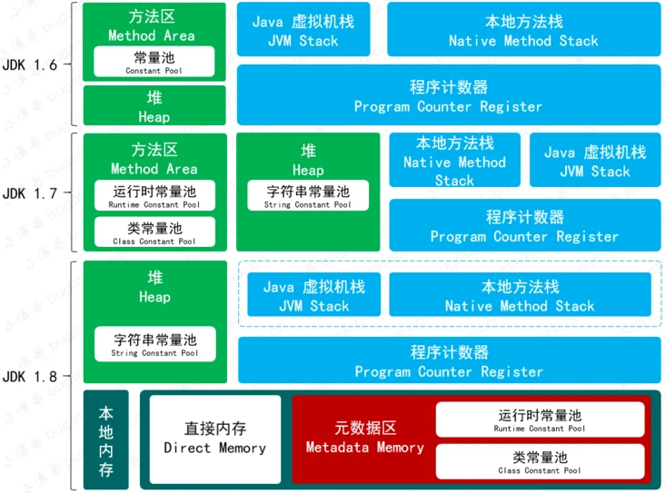

# Java 语言相关

希望你也能激动地说出 "噫! 好! 我中了".

1. [Java 语言相关](#java-语言相关)
   1. [Java](#java)
      1. [volatile 关键字的意义](#volatile-关键字的意义)
      2. [Java 线程池有几个类型, 各自的作用](#java-线程池有几个类型-各自的作用)
      3. [Java 线程池的拒绝策略](#java-线程池的拒绝策略)
      4. [Java 锁机制](#java-锁机制)
   2. [JVM](#jvm)
      1. [JVM 内存模型](#jvm-内存模型)
         1. [程序计数器](#程序计数器)
         2. [Java 虚拟机栈](#java-虚拟机栈)
         3. [本地方法栈](#本地方法栈)
         4. [堆和元空间](#堆和元空间)
      2. [JVM 垃圾回收](#jvm-垃圾回收)
         1. [G1 垃圾回收器](#g1-垃圾回收器)
      3. [main 方法 new 了一个类, 并调用他的 run 方法, JVM 中都发生了什么](#main-方法-new-了一个类-并调用他的-run-方法-jvm-中都发生了什么)
   3. [哈希](#哈希)
      1. [ConcurrentHashMap 和 HashTable 有什么区别](#concurrenthashmap-和-hashtable-有什么区别)
         1. [Java 1.7 和 1.8 的实现是什么](#java-17-和-18-的实现是什么)
      2. [HashSet 的底层实现](#hashset-的底层实现)
         1. [为什么内置 HashMap](#为什么内置-hashmap)
            1. [HashMap 的数据结构](#hashmap-的数据结构)
      3. [为什么 loadFactor 是 0.75?](#为什么-loadfactor-是-075)
      4. [什么是泊松分布](#什么是泊松分布)
         1. [为什么要高位参与与运算](#为什么要高位参与与运算)
         2. [为什么它的 size 是 2 的 n 次方](#为什么它的-size-是-2-的-n-次方)
         3. [为什么默认是 16](#为什么默认是-16)
         4. [扩容机制](#扩容机制)
         5. [为什么线程不安全](#为什么线程不安全)
         6. [为什么会死循环](#为什么会死循环)
         7. [如何解决死循环与线程安全](#如何解决死循环与线程安全)
   4. [Spring 框架](#spring-框架)
      1. [AOP 切片设计](#aop-切片设计)
   5. [闲杂文字](#闲杂文字)

## Java

1. `StringBuffer` 和 `StringBuilder` 的区别.

    - 两者底层都是 `char[], StringBuilder` 不是线程安全的类, `StringBuffer` 是线程安全的类, 其实现线程安全的方法是给每个方法加上了 `synchronized`.

2. `ThreadLocal` 是什么.

    - `ThreadLocal` 是无并发的线程安全容器, 其内部自己实现了一个 Map 数据结构, key 是线程的 id, value 是线程的值.

3. java 程序产生内存溢出的排查过程.
    - 设置 Xmx 小一点, 这样最终产生的 dump 文件方便分析, 使用 jhat 或者 jvisualvm 分析 dump 文件, 注重观察占用最多 bytes 的类是什么并分析这些类为什么没有被 jvm 回收从而导致 oom.

### volatile 关键字的意义

1

### Java 线程池有几个类型, 各自的作用

1

### Java 线程池的拒绝策略

1

### Java 锁机制

1

## JVM

> Java 程序属于用户进程, 所以相对内核空间而言 Java 程序一定是运行在用户空间的. 同时因为 Java 是高级语言不编译成机器代码, 所以需要解释器 JVM 来汇编成机器代码.

### JVM 内存模型

> 内存模型就是 JVM 运行时数据区依照 JVM 虚拟机规范的具体实现过程.

早期 JVM 分为三大块: YoungGen, OldMemory, Perm.

JDK 1.6 时, 静态变量存放在永久代上.

JDK 1.7 时, 但已经把字符串常量池, 静态变量存放在堆上, 逐渐的减少永久代的使用.

Perm 后来因为用不上给移除了, 此时 JDK 已经是1.8, 运行时常量池, 类常量池都保存在元数据区, 字符串常放在堆里.

#### 程序计数器

一个较小内存空间, 线程私有, 记录当前线程所执行的字节码行号.

执行 Java 方法时, 计数器记录虚拟机字节码当前指令地址, 本地方法记录为空. 这一块区域没有 OutOfMemoryError 定义.

#### Java 虚拟机栈

每一个方法在执行的同时都会创建出一个栈帧, 用于存放局部变量表, 操作数栈, 动态链接, 方法出口, 线程信息等.

从方法调用到执行完成, 都对应着栈帧从虚拟机中入栈和出栈过程.

最终, 栈帧会随着方法的创建到结束而销毁.

#### 本地方法栈

本地方法栈与 JVM 栈作用类似, 不同点在于本地方法执行的是 Native 方法, 而 JVM 执行 Java 方法.

另外, 与 JVM 一样, 本地方法也会抛出 StackOverflowError 和 OutOfMemoryError 异常.

JDK 1.8 的 HotSpot 虚拟机将本地方法栈与虚拟机方法栈合二为一了.

#### 堆和元空间

JDK 1.8 JVM 的内存结构主要由三大块组成: 堆内存, 元空间, 栈.

- Java 堆是内存空间占据最大的一块区域.
- Java 堆由新生代 (占据 1/3 堆空间) 和老年代 (占据 2/3 堆空间) 组成

### JVM 垃圾回收

1

#### G1 垃圾回收器

### main 方法 new 了一个类, 并调用他的 run 方法, JVM 中都发生了什么

1

## 哈希

### ConcurrentHashMap 和 HashTable 有什么区别

#### Java 1.7 和 1.8 的实现是什么

### HashSet 的底层实现

#### 为什么内置 HashMap

##### HashMap 的数据结构

### 为什么 loadFactor 是 0.75?

### 什么是泊松分布

#### 为什么要高位参与与运算

#### 为什么它的 size 是 2 的 n 次方

#### 为什么默认是 16

#### 扩容机制

> 什么时候红黑树变换?

#### 为什么线程不安全

#### 为什么会死循环

#### 如何解决死循环与线程安全

## Spring 框架

### AOP 切片设计

## 闲杂文字

并发高的 api 需要大量本地内存缓存, 是框架引用了你的对象; Controller -> Service -> DAO 其实你业务代码栈空间这块其实已经没有引用了, 讲道理实际上大部分只在栈空间上存在引用的对象是活不到老年代的.
