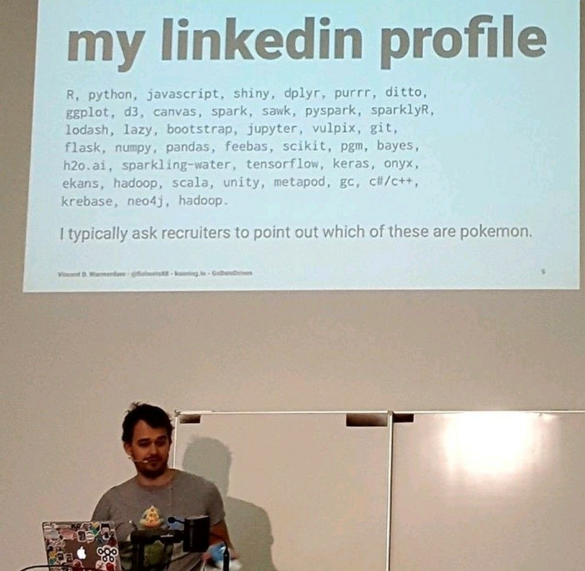

# CV

SRE / Web Full Stack / DevOps developer, Data Scientist.

## What will I do

- B/S Architecture Web Application Development:

    - Use Java, JavaScript, SQL languages.
        - Experience with the Spring Boot framework and the Vue.js framework for single-page applications.
        - Know how to utilize different ORMs and security frameworks.
    - Distributed application:
        - Recognize the concept and principles of microservice architecture, as well as the Spring Cloud framework's application.
        - Know how to use the Eureka server's discovery service and the Kafka message queue.

- Maintenance and operation:

    - Get a fundamental understanding of Linux container technologies and Docker commands.
    - Know how to build a Java and NodeJs application environment on Linux; Understand the basic configuration of nginx.
    - Learn how to install and use MySQL and PostgreSQL databases on Linux.
    - Understand the application construction and management of Hadoop and ecosystem.
    - Years of VPS maintenance, have trojan troubleshooting and repair expertise; knowledge of cluster load balancing, traffic forwarding, and CDN services.

- Familiarity with Git; capacity to develop documentation; mastery of information retrieval; eagerness to learn new technologies

- Be familiar with scripting languages such as PowerShell, Bash, and others.

## Work Experience

- Company: Kunming Research, Exploration, and Design Institute of PowerChina Construction Group

    - Location: China
    - Position: R&D position in GIS / BIM.
    - Duration: Apr 2021 - Jan 2022

        - Response: contribute to the development of "Kunming smart water system" front-end & back-end apps and post-maintenance-services-services.

            - Mainly used techs: Spring Boot, Vue, MySQL, MongoDB.

            - Project content: Responsible for fulfilling customer follow-up requirements, bug fixes, data process.

        - Response: contributed to the "Construction Management Information System of Yunnan Province's 'Center of Dian Water Diversion Project (Phase I)'" front-end & back-end application development, database design, and other aspects of the .

            - Mainly used techs: Separation of front-end and back-end architectures, Spring Cloud, Vue, MySQL, MongoDB, Redis, Nacos, Docker, etc.

            - Project content: Responsible for the quick development of the project prototype system's initial phase, as well as the design of testing database, pre-product database, and low-code platforms aka. code generator.

- Open source community
    - Fix a [serious bug](https://github.com/qier222/YesPlayMusic/issues/1019) and other smaller flaws in [YesPlayMusic](https://github.com/qier222/YesPlayMusic).

    - Helped with the early development and testing of [style2paints](https://github.com/lllyasviel/style2paints) (also logo designed by me).

    - Contributed to another style2paints project, [PaintingLight](https://github.com/lllyasviel/PaintingLight), and [MangaCraft](https://github.com/lllyasviel/MangaCraft) (now merged functionality into s2p, so the repositories deleted).

    - Helped with the testing of [DeepCreamPy](https://github.com/liaoxiong3x/DeepCreamPy).

    - Help with [VRoid Studio](https://github.com/xiaoye97/VRoidChinese) translation.

    - Member of the FreeBSD Chinese community, contributed to document authoring and translation.
